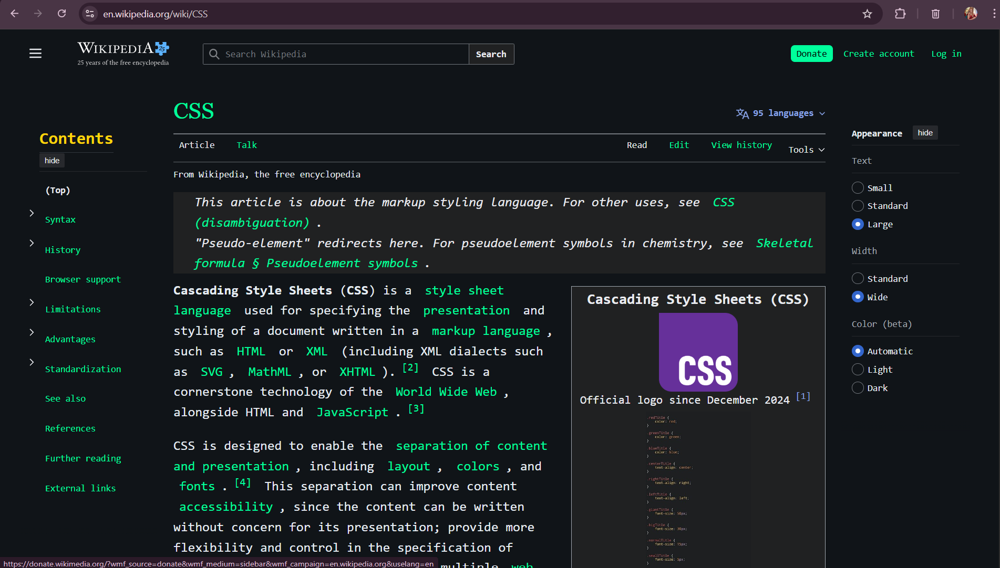

# Lab2_Web

This repository contains two separate parts:

1. **Wikipedia Ricing (CSS customization)**
2. **After Closing Hours (Interactive HTML + CSS Game)**

---

## Part 1 — Wikipedia Ricing

Ricing for Wikipedia — a small stylesheet that restyles Wikipedia for a cleaner, modern look.

This repository contains a Stylus-compatible CSS file that customizes Wikipedia's appearance (colors, typography, spacing).

**Stylesheet location:**

```
Ricing/CSSWiki/wikipedia-ricing.css
```

### Before


### After



---

## Part 2 — After Closing Hours

### Game Description

**After Closing Hours** is an immersive, interactive fiction game developed in HTML and CSS.

You wake up trapped inside a shopping mall after closing hours with no way out. Navigate through dark corridors, mysterious shops, and suspicious locations while making crucial decisions that determine your fate.

Your mission is simple yet dangerous: **find a way to escape to the street and survive the night.**

---

### Story & Setting

You fell asleep in the food court of a shopping mall. When you wake up, the building is completely empty, the doors are locked, and an eerie silence fills the air. As you begin to explore, you realize you're not alone...

⚠️ **Warning:** Your choices matter. Some paths lead to freedom, others to eternal entrapment—or worse.

---

### How to Play

- Read the story text carefully — it contains important clues about your surroundings  
- Look at the images — they help set the atmosphere and give context  
- Click on the navigation links to make decisions and move through the mall  
- Be strategic — not all paths are safe, and some lead to dead ends  

---

### Controls

- **Left-click** on any highlighted link to select a story option and progress through the game  

---

### Game Mechanics & Rules

| Rule | Consequence |
|------|------------|
| You see the Street | **YOU WIN** — Escape and survive |
| Pasillo Bucle (Loop Hallway) | You become trapped forever in an endless loop |
| Meet the Entity | One encounter: you survive. Two encounters: **GAME OVER** |
| Dead-End Room (Sin Salida) | You survive but remain trapped forever with no escape |

**Reminder:** There is no form of return.

---

### Possible Endings

#### Ending A – ESCAPE (Good Ending)

**Description:** You successfully navigate the mall and reach the street.  
**Outcome:** Freedom! You survive and escape the mall.

#### Ending B – TRAPPED (Neutral Ending)

**Description:** You reach a room with no exit OR become stuck in an endless hallway loop.  
**Outcome:** You survive but are permanently trapped inside the mall with no way out.

This can happen by:
- Entering a "Pasillo Bucle"
- Finding a "Sin Salida" room

#### Ending C – DEATH (Bad Ending)

**Description:** You encounter the mysterious entity twice.  
**Outcome:** The entity catches you — game over.

---

### Requirements

- Modern web browser (Chrome, Firefox, Edge, Safari)

---

### Game Structure

The game is organized as an HTML-based interactive fiction with interconnected pages representing different locations within the mall. Each page contains:

- Story text  
- An image  
- Navigation options to other locations  

---

**Enjoy your stay at After Closing Hours... if you can survive it!**

---

### Video Demo

