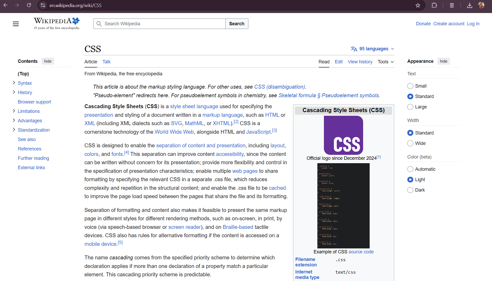

# Lab2_Web

Ricing for Wikipedia — a small stylesheet that restyles Wikipedia for a cleaner, modern look.

This repository contains a Stylus-compatible CSS file that customizes Wikipedia's appearance (colors, typography, spacing). The stylesheet is located at `Ricing/CSSWiki/wikipedia-ricing.css`.

## Before

## After